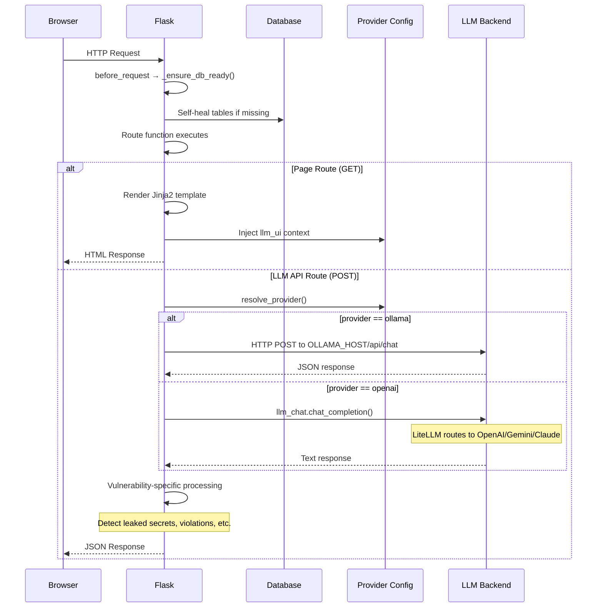
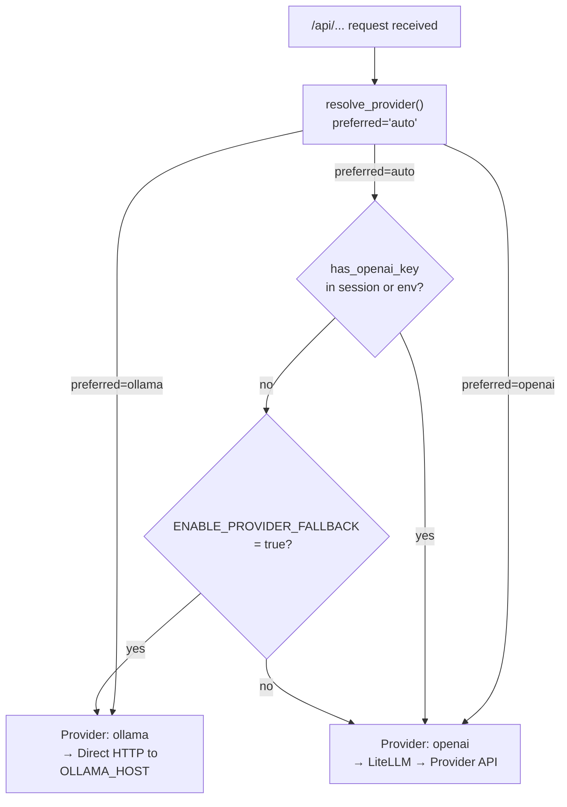
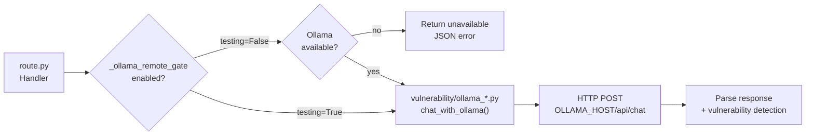
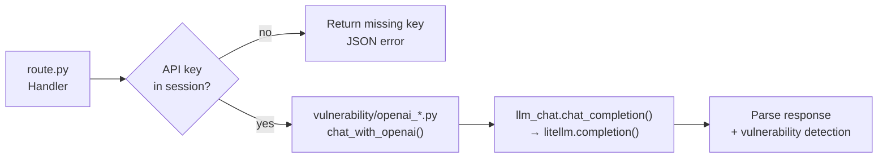
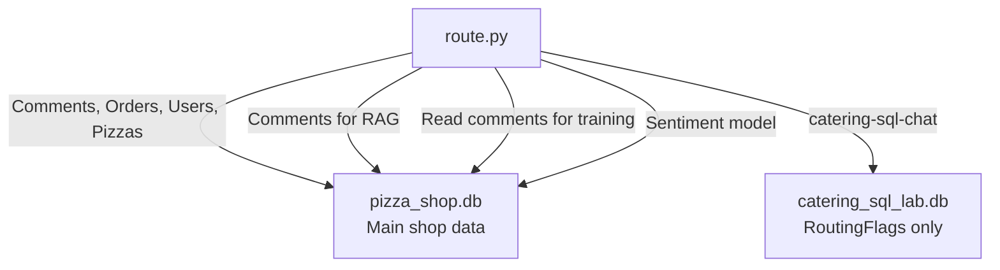

# Data Flow

This document describes how requests move through the application, from browser
to LLM backend and back.

## Request Lifecycle

## LLM Provider Resolution

## Ollama Chat Flow

## Cloud LLM Chat Flow

## Database Access Pattern

The main database (`pizza_shop.db`) is read by nearly every route. A secondary
database (`catering_sql_lab.db`) is used only by the catering SQL tool lab:

## Vulnerability Detection

After each LLM response, the route handler performs vulnerability-specific
detection on the output:

| Vulnerability | Detection | What it looks for |
|--------------|-----------|-------------------|
| Sensitive Info Disclosure | `detect_sensitive_info()` | SSNs, credit cards, emails, VIP names |
| Order Access | `detect_order_access()` | Other users' order details |
| Misinformation | (UI comparison) | Response vs. known facts |
| Direct Prompt Injection | Level secret match | Secret coupon word in output |
| Excessive Agency | Order placed check | New DB order records |
