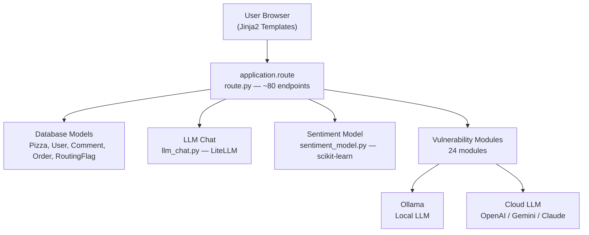
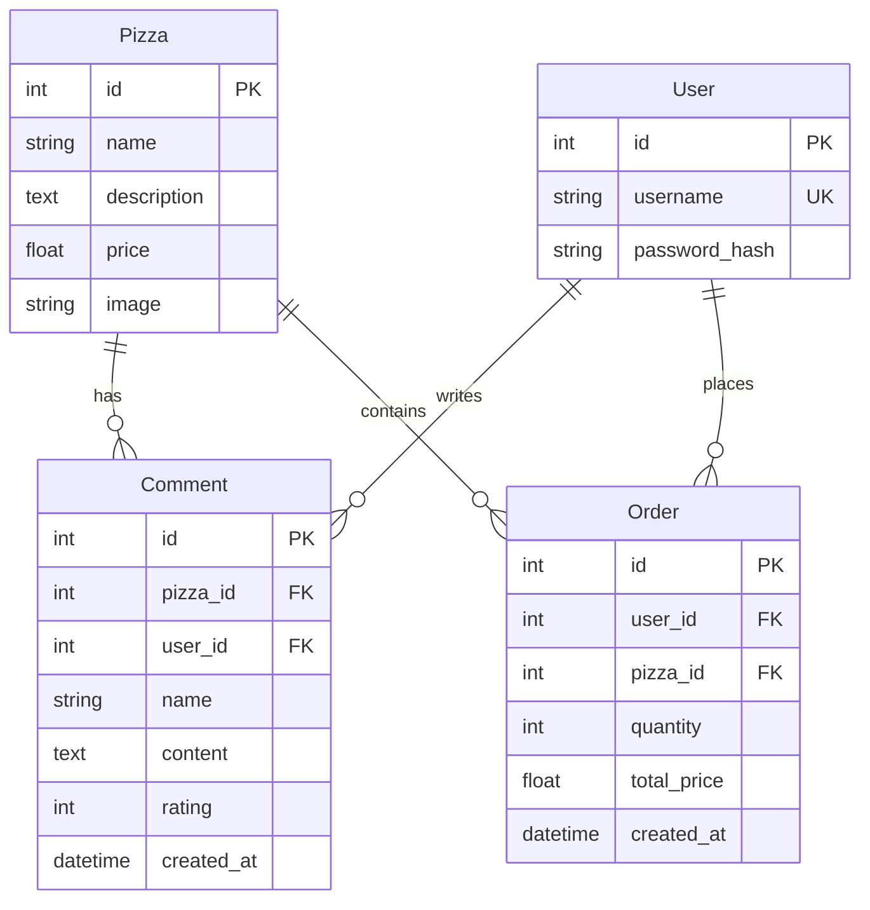
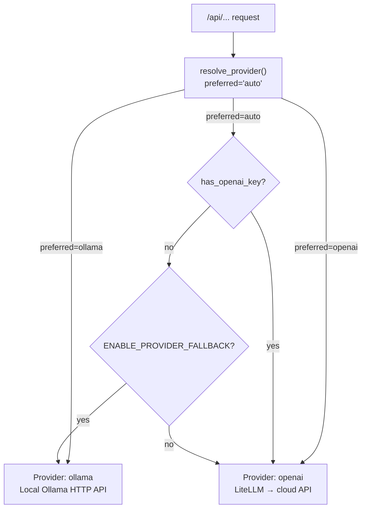

# Architecture

PwnzzAI Shop is a **Flask 3.1 monolithic application** with a plugin-style vulnerability
module system, dual LLM backends (local Ollama + cloud LiteLLM), dual SQLite databases,
and a scikit-learn sentiment model — all wrapped in a pizza shop theme.

## System Overview



## Core Application Stack

| Layer | Location | Technology | Role |
|-------|----------|------------|------|
| App Factory | `application/__init__.py` | Flask + SQLAlchemy | Creates Flask app, binds DB, registers routes |
| Config | `config.py` | Environment variables | SQLite URIs, secret key |
| Routes | `application/route.py` | Flask views | ~80 endpoints — auth, pizza shop, labs, APIs |
| Models | `application/model.py` | SQLAlchemy ORM | 5 models — Pizza, User, Comment, Order, RoutingFlag |
| LLM Abstraction | `application/llm_chat.py` | LiteLLM | Unified `chat_completion()` for any provider |
| Provider Config | `application/provider_config.py` | Environment + session | Resolves which LLM provider/keys to use |
| Ollama Setup | `application/ollama_setup.py` | HTTP + subprocess | Start/pull/check Ollama models |
| Sentiment Model | `application/sentiment_model.py` | scikit-learn | LogisticRegression trained on pizza comments |
| Prompt Templates | `application/prompts/` | Jinja2 | B0-B9 escalation ladder system prompts |
| Templates | `application/templates/` | Jinja2 HTML | 22 templates (navbar, pages, labs) |

## Module Dependency Map

Generated by [pyan3](https://github.com/Technologicat/pyan) — edges show import/call dependencies:

### Core Module Dependencies

```
application (__init__.py)
  └── application.route                 — route registration (circular-safe import)
        ├── application.model           — Pizza, User, Comment, Order, RoutingFlag
        ├── application.provider_config — OLLAMA_HOST, OLLAMA_MODEL, llm_ui_snapshot, etc.
        ├── application.sentiment_model — create_model(), get_data()
        ├── application.llm_chat        — via vulnerability modules
        ├── application.vulnerabilities.* — all 24 vulnerability modules
        └── application.ollama_setup    — ensure_ollama_running, check_and_pull_model

application.provider_config
  └── (self-contained config module, no other application imports)
        Environment variables read:
          OLLAMA_HOST, OLLAMA_MODEL, OLLAMA_FALLBACK_MODEL
          OPENAI_API_KEY, OPENAI_MODEL
          LITELLM_MODEL, GEMINI_MODEL, GEMINI_API_KEY
          LAB_CLOUD_LLM_MODEL, LAB_CLOUD_LLM_MODEL_EXCESSIVE_AGENCY
          LLM_UI_*, MODEL_TIMEOUT_SECONDS, ENABLE_PROVIDER_FALLBACK, etc.

application.llm_chat
  └── application.provider_config       — MODEL_TIMEOUT_SECONDS, resolved_litellm_model
        Uses litellm.completion() for all provider-agnostic LLM calls.

application.ollama_setup
  └── (standalone — talks to Ollama HTTP API directly)

application.sentiment_model
  └── application.model.Comment         — reads comments for training data
        Uses scikit-learn CountVectorizer + LogisticRegression

application.prompts.b_stream
  └── (Jinja2 template rendering from prompts/direct_prompt_escalation/)
```

### Vulnerability Module Dependencies

Each vulnerability module follows one of two patterns:

**Ollama-backed modules** (direct HTTP to Ollama API):
```
ollama_*.py
  └── self-contained, calls Ollama HTTP API
  └── uses: get_conversation_model(), extract_function_calls(), chat_with_ollama()
```

**Cloud-backed modules** (via LiteLLM):
```
openai_*.py
  ├── application.llm_chat              — chat_completion()
  └── application.provider_config       — lab_cloud_llm_model_default
```

**Shared modules** (used by both patterns):
```
catering_rag_lab.py        — RAG with FAISS + sentence-transformers
catering_sql_tool_lab.py   — Agentic SQL tool routing with db
direct_prompt_escalation.py — B0-B9 escalation ladder
promotion_indirect_injection.py — Photo upload indirect injection
toxicity_support_lab.py    — Customer support safety lab
supply_chain.py            — Malicious pickle model demos
model_theft.py             — Model extraction attack logic
data_poisoning.py          — Data poisoning attack logic
```

## Database Architecture

### Primary Database: `pizza_shop.db`

The main shop database with 4 models:



### Secondary Database: `catering_sql_lab.db`

A separate SQLite database bound to `RoutingFlag` model via `SQLALCHEMY_BINDS["catering_sql"]`. Used by the catering agentic SQL / tool routing lab to isolate exploit data from the main shop.

```
┌──────────────────┐
│   RoutingFlag    │
├──────────────────┤
│ id (PK)          │
│ username (unique)│
│ flag_code        │
└──────────────────┘
```

Sample flags: `RT-ALICE7A`, `RT-BOB9F2`

## LLM Provider Resolution Flow



Provider selection happens per-request via `resolve_provider()`. Cloud model names
are resolved through a chain: `LAB_CLOUD_LLM_MODEL` → `GEMINI_MODEL` → `OPENAI_MODEL`,
with `LITELLM_MODEL` overriding everything for the Lab Setup UI.

## Request Lifecycle

```
1. Flask receives request
2. @app.before_request → _ensure_db_ready() — self-heals DB tables
3. Route function executes — renders template or returns JSON
4. Template renders via Jinja2 (with llm_ui context injected by @app.context_processor)
5. Response returned to browser
```

For LLM-powered routes:
```
1. Route receives user input (JSON body, form, file upload)
2. resolve_provider() decides Ollama vs cloud
3. For Ollama: direct HTTP to OLLAMA_HOST
4. For cloud: llm_chat.chat_completion() → LiteLLM → provider API
5. Vulnerability-specific processing detected on response
6. JSON returned to frontend
```

## Security Model

PwnzzAI is **intentionally insecure** — the vulnerabilities are the features. However:

- **Session-based auth**: werkzeug `generate_password_hash` for passwords
- **No CSRF enforcement** for POST endpoints
- **No rate limiting** (except simulated in DoS demos)
- **Ollama gateway check**: `_ollama_remote_gate_enabled()` skips probe during tests
- **API key validation**: minimal check (`sk-` prefix check for OpenAI, length >= 8 for others)
