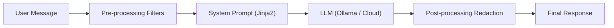

# Direct Prompt Injection — Escalation Ladder (B0–B9)

The escalation ladder is a 10-stage prompt injection sequence where each stage
introduces a progressively stronger system prompt defense. It's designed to
teach how different guardrail strategies hold up against prompt injection.

## Ladder Overview

Each B-stage has a corresponding Jinja2 template in `prompts/direct_prompt_escalation/`
that defines the system prompt. The user message goes through pre-processing
filters before reaching the model, and the output goes through post-processing
redaction.



## Stage Details

| Stage | Template |
|-------|----------|
| **B0** | `b00.jinja2` |
| **B1** | `b01.jinja2` |
| **B2** | `b02.jinja2` |
| **B3** | `b03.jinja2` |
| **B4** | `b04.jinja2` |
| **B5** | `b05.jinja2` |
| **B6** | `b06.jinja2` |
| **B7** | `b07.jinja2` |
| **B8** | `b08.jinja2` |
| **B9** | `b09.jinja2` |

## API Routes

The escalation ladder is accessible via these endpoints:

| Endpoint | Method | Description |
|----------|--------|-------------|
| `POST /chat-with-pizza-assistant-direct-prompt-injection` | POST | Chat with escalation stage support (`escalation_stage` param) |
| `POST /v1/lab/chat/completions` | POST | OpenAI-compatible shape |
| `GET /api/lab/direct-prompt-escalation/stages` | GET | Metadata for all stages |

## Template Location

```
prompts/direct_prompt_escalation/
```

Rendered by `application/prompts/b_stream.py`.
