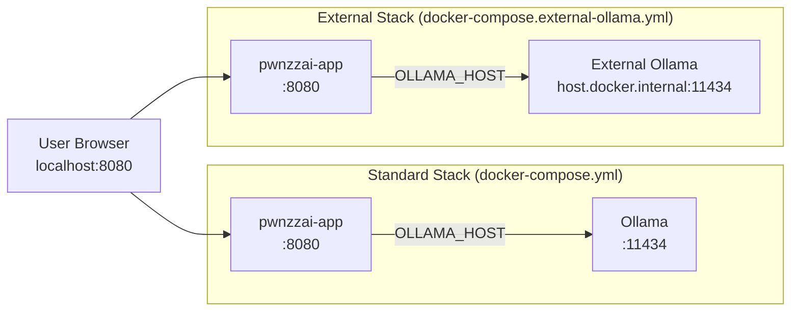

# Docker Orchestration

Container architecture and deployment modes.

## Container Overview

| Container | Image | Purpose |
|-----------|-------|---------|
| `pwnzzai-app` | `pwnzzai:latest` / local build | Flask app on port 8080 |
| `ollama` | `ollama/ollama` | Local LLM on port 11434 |

## Compose Files

| File | Ships | Use case |
|------|-------|----------|
| `docker-compose.yml` | PwnzzAI + Ollama | Standard stack (Option 1) |
| `docker-compose.external-ollama.yml` | PwnzzAI only | External Ollama (Option 2) |
| `deploy/docker-compose.workshop.yml` | CTFd + Flask + Ollama | Workshop deployment |
| `deploy/docker-compose.workshop.nvidia.yml` | GPU-enabled workshop | NVIDIA GPU workshop |

## Dockerfiles

| File | Purpose |
|------|---------|
| `Dockerfile` | Main Python 3.11 slim app image |
| `Dockerfile.ollama` | Bundled Ollama container |
| `deploy/Dockerfile.pwnzzai-workshop` | Workshop-specific Flask image |
| `deploy/Dockerfile.ctfd-workshop` | CTFd workshop image |

## Networking



## Quick Commands

```bash
# Standard stack
docker compose up -d
docker compose down

# With local image build
docker build -t pwnzzai-local:dev .
PWNZZAI_IMAGE=pwnzzai-local:dev docker compose up -d

# External Ollama
docker compose -f docker-compose.external-ollama.yml up -d

# Pull models inside container
docker exec ollama ollama pull llama3.2:1b

# View logs
docker compose logs -f pwnzzai-app
```

See the [Makefile](https://github.com/OWASP/PwnzzAI/blob/main/Makefile) for all compose targets (`make compose-up`,
`make compose-down`, `make compose-ext-up`, etc.).
